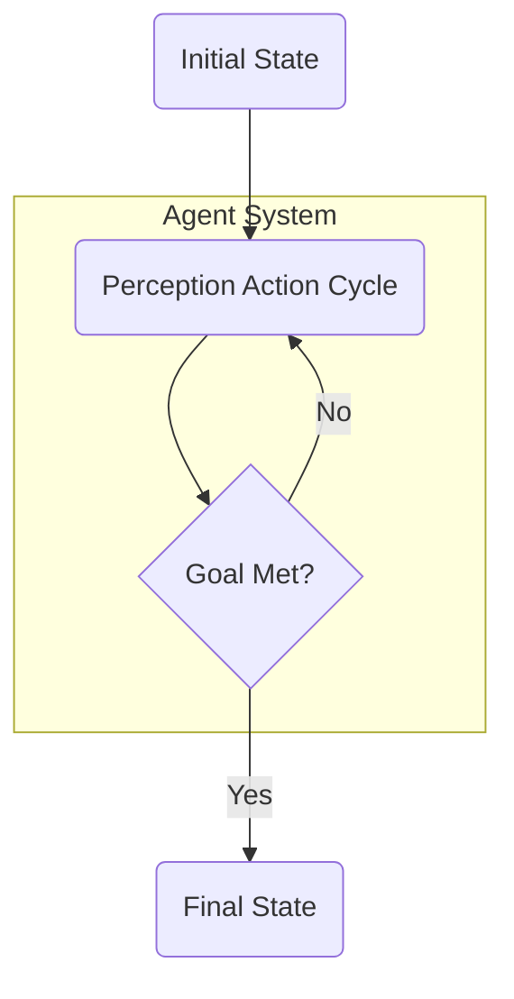

# Sembla

Sembla is a functional framework for developing AI agent systems.

## Flowchart

```mermaid
graph TB
  InitialState(Initial State) --> PerceiveAndAct
  subgraph "Agent System"
    PerceiveAndAct(Perception Action Cycle) --> Evaluate
    Evaluate{Goal Met?} -- No --> PerceiveAndAct
  end
    Evaluate -- Yes --> FinalState(Final State)
```
