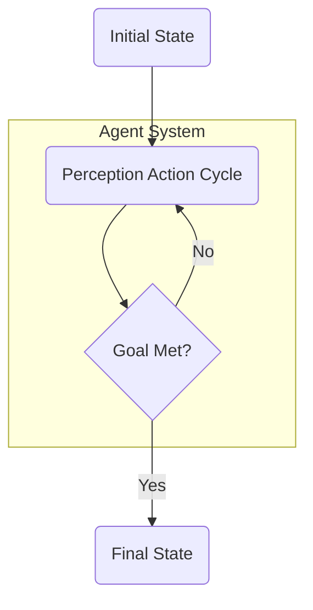

# Sembla

Sembla is a functional framework for developing AI agent systems.

## Contributing

1. Fork the repository.
2. Create a new branch for your feature or bug fix.
3. Commit your changes and submit a pull request.

## Flowchart

## License

This project is currently closed source.
